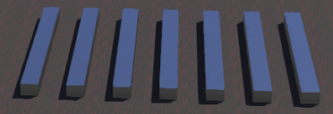

## Pychrono&Webots

### Prerequisites

> [Install Webots][https://cyberbotics.com/doc/guide/installing-webots]
>
> [Install Pychrono][https://api.projectchrono.org/pychrono_installation.html] you can see [video][https://www.bilibili.com/video/BV1eM4m197HD/?share_source=copy_web&vd_source=ba28382af1c25f639454a0f0717ec782]

### Run

> conda activate chrono(Used when installing pychrono)
>
> python main.py

### User interaction interface

#### Click Webots

##### build slope

#### build stair

#### build ditch

#### build rough

#### build pit

#### buildFrom3DModel: select an obj file

### Pychrono: select obj file & texture file
#### overall picture

#### Driver's view

### Video: see folder source terrainVideo.m4v
<video
src="./source/terrainVideo.mov" controls=""
height=400 
width=600> 
</video>

